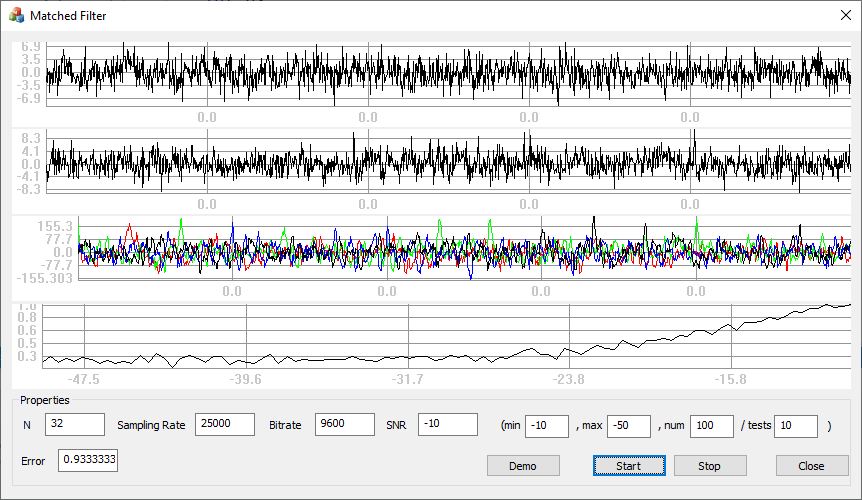

# scm-2-matched-filter @ d8euAI8sMs

Part of [d8euAI8sMs](https://github.com/d8euAI8sMs) namespace. See [`learning` repository](https://github.com/d8euAI8sMs/learning) for details.

## About

QPSK demodulation of binary data encoded with the help of Gold sequence by the means of matched filter.



## Details

Rust and C++ interop (Rust 1.38.0, Visual Studio 2019, x64 only). GUI is implemented in C++ (MFC), all computations are writted in Rust (separate dll).

See docs for some guides on how to build, run and how all this work.

## Getting Source Code

Use the following command to clone this repository:

```sh
git clone --recurse-submodules https://github.com/d8euAI8sMs/scm-2-matched-filter.git
```

or clone it as part of `learning` repository:

```sh
git clone --recurse-submodules https://github.com/d8euAI8sMs/learning.git
```
